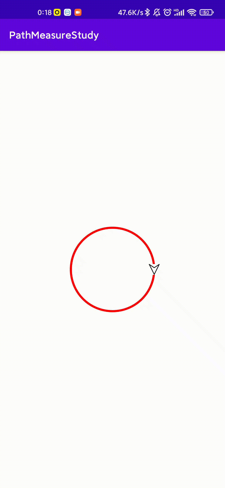

### PathMeasure学习

一个简单demo，让图片跟着path前进

步骤

1.绘制path

```kotlin
// todo  初始化pathMeasure与path
override fun onSizeChanged(w: Int, h: Int, oldw: Int, oldh: Int) {
    super.onSizeChanged(w, h, oldw, oldh)
    path.addCircle(width / 2f, height / 2f, 200f, Path.Direction.CW)
    pathMeasure.setPath(path,false)
    animate.start()
}
```

2.通过Pathmeasure的当前path固定长度的坐标与切点角度

```
pathMeasure.getPosTan(pathMeasure.length*mProcess,floatArrayPoint,floatArrayTan)
val angle = atan2(floatArrayTan[0].toDouble(),floatArrayTan[1].toDouble())*180f/ PI
```

3.将图片绘制在计算的坐标上，并且旋转计算出来的角度

```
mMatrix.reset()
mMatrix.postRotate(- angle.toFloat() + 90,bitmap.width/2f,bitmap.height/2f)
mMatrix.postTranslate(floatArrayPoint[0] - bitmap.width/2f,floatArrayPoint[1] -bitmap.height/2f)
canvas.drawBitmap(bitmap,mMatrix,paint)
```

4.使用动画

效果图


